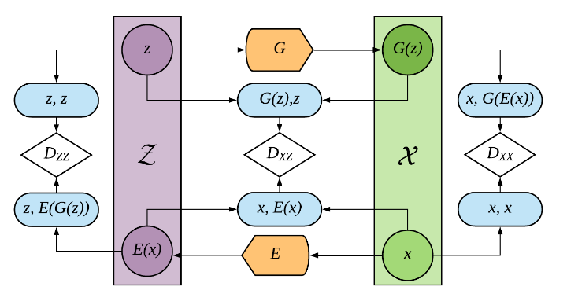
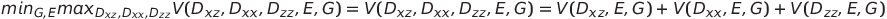
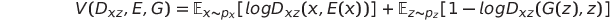
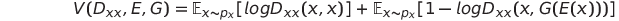
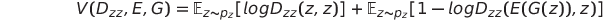
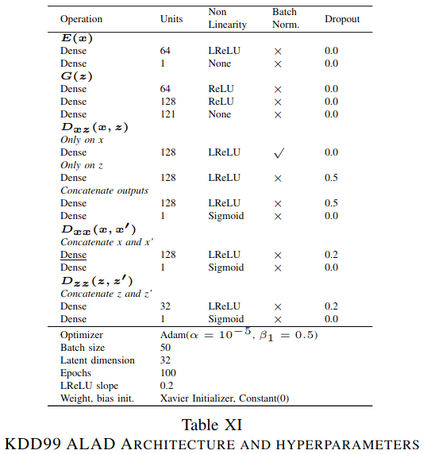
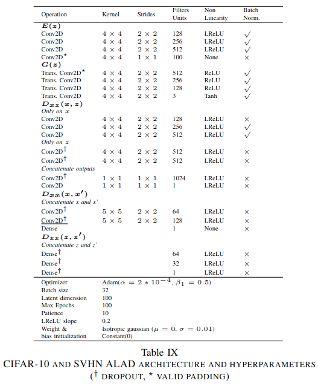

# Adversarially Learned Anomaly Detection[*](https://arxiv.org/pdf/1812.02288.pdf)

This repository reproduces the work of the
Paper [Adversarially Learned Anomaly Detection](https://arxiv.org/pdf/1812.02288.pdf) (ALAD) [[1](https://arxiv.org/pdf/1812.02288.pdf)].

## Anomaly Detection

As the name said, anomaly detection is the identification of anomalies in data. 
Instances of data are considered as anomalies, if they differ significantly from the
majority of the data and therefore, raise suspicions. 
They are also called outliers, noise or novelties.
So, anomaly detection is the identification of rare items, events or observations
[[6](https://avinetworks.com/glossary/anomaly-detection/),
[7](https://en.wikipedia.org/wiki/Anomaly_detection),
[8](https://nix-united.com/blog/machine-learning-for-anomaly-detection-in-depth-overview/)].

In context of Cybersecurity, applications of anomaly detection can vary widely. 
It can be used to detect 
unauthorized access attempts or suspicious activity such as unusual types of 
requests. It is applicable for 
fraud or intrusion detection and can also prevent sensitive data leaks 
[[7](https://en.wikipedia.org/wiki/Anomaly_detection), 
[8](https://nix-united.com/blog/machine-learning-for-anomaly-detection-in-depth-overview/)].

There are three main classes of anomaly detection techniques: unsupervised, semi-supervised, and supervised. 
This repository refers to an unsupervised approach for anomaly detection. One of the most important
assumptions is here that the dataset used for the learning purpose contains mainly non-anomalous data and
only a small partition of the dataset is malicious and abnormal. Thus, unsupervised 
anomaly detection algorithms deem collections of frequent, similar instances to be
normal and identify infrequent data groups as malicious
[[6](https://avinetworks.com/glossary/anomaly-detection/)].

## Introduction to ALAD
The ALAD model belongs to such unsupervised anomaly detection algorithms. 
Its method is predicated on bi-directional GANs [[2](https://arxiv.org/pdf/1605.09782v7.pdf)],
i.e. it consists not only of a generator and discriminator, but also an encoder. The encoder represents the 
opposite operation to the generator. It transforms samples from data space to 
latent space, vice versa the generator. After training the model in an 
unsupervised manner, the ALAD model outputs scores for each data sample by utilizing reconstructions errors, which indicate whether a data sample is anomalous or not. 
Furthermore, ALAD ensures cycle-consistency between data and latent space and uses methods to 
stabilize GAN-training. By doing so, the ALAD model accomplishes state-of-the-art 
performance on a range of image and tabular datasets. This repository was able to 
reproduce and validate these results.

## ALAD architecture

In GANs [[9](https://arxiv.org/pdf/1406.2661.pdf)], the generator receives random variables, _z_, sampled from a latent Gaussian distribution as input
and tries to generate data, _X_, resembling data space that should be learned. In contrast, the discriminator tries to
distinguish between real data samples and those produced by the generator. During training the generator tries 
to better fool the discriminator and the discriminator to better detect real and fake samples.

The architecture of the ALAD model is expanded by a few networks so that it comprises 
a generator _G_, an encoder _E_ and three discriminators _DZZ_,  _DXZ_ and  _DXX_. 
As mentioned, encoder learns to invert the generator which maps data samples _X_ 
to the latent space _z_ during training. Both are not directly connected and they never see their outputs.
Each discriminator obtains as input a two-dimensional tuple,  _DXZ_ at the first position a data sample and 
at the second position a latent variable, _DXX_ 
at both positions samples from data space and _DZZ_
 at both positions variables from latent space. 
The discriminator _DXZ_ is similar to the discriminator of 
GAN. It not only distinguish between real and fake sample, but 
also between _z_ and _E(X)_.
 So, the generator learns to infer the data space and the encoder to project a
  data sample into the latent space. 
The discriminator _DXX_ learns to recognize if the second input is equal to the first. The same applies for _DZZ_, only with different input.

## Stabilizing GAN-Training and objective of ALAD

The aim of this GAN is that cycle-consistency is achieved, 
i.e. the reconstruction _G_(_E_(_X_)) is almost equal to original 
sample _X_ in order to use it for the reconstruction-based anomaly 
detection method. This is accomplished by incorporating three terms into the objective which is defined as follows:

The first term is known from the BiGAN [[2](https://arxiv.org/pdf/1605.09782v7.pdf)] and defined as follows:

 The second term was established by the ALICE Paper [[3](https://arxiv.org/pdf/1709.01215.pdf)] and is defined as follows:

The last one was implemented by the authors themself and is defined as:

By employing the discriminator _DXX_, it is achieved that the encoder can map data into the latent space so that the generator can best possible reconstruct the encoded samples. The reason is that the generator and encoder must "work together" to fool _DXX_.The same principle applies for the discriminator _DZZ_, only vice versa. 

## How to detect anomalies?

The ALAD model is a reconstruction-based anomaly detection technique which decides whether a sample is anomalous based 
on the distance of the original sample and its reconstruction.
By reaching cycle-consistency it is ensured that the ALAD model can learn to encode and reconstruct 
samples from data space and this is needed to evaluate how far a sample is from its reconstruction. 
If the model is exclusively trained with normal samples, then we expect that samples from the normal 
distribution can be accurately reconstructed whereas anomalous samples will likely be poorly reconstructed. 
Subsequently, the distance between original and reconstructed samples has to be determined in order to assess how
far or close a sample is to its reconstruction.
In the ablation studies of the authors it turned out that utilizing the Euclidean distance between the 
original samples and their reconstructions in data space performed not best. Instead
the output before the logits (i.e. before the last layer) of the discriminator _DXX_ is taken, 
where once the input is twice the sample itself and once the sample 
and the corresponding reconstruction. Then, a L1 loss
is computed between these two outputs and used as an anomaly score.
After training the model, only _G_, _E_ and _DXX_ is needed for the anomaly detection task and
 the procedure of the score calculation can be described as follows:

## Experiment Setup

This repository reproduces the results from the tabular dataset [_KDDCup99_](https://archive.ics.uci.edu/ml/index.php)
 [[3](https://arxiv.org/pdf/1709.01215.pdf)] and the image dataset
  [_CIFAR-10 dataset_](https://www.cs.toronto.edu/~kriz/learning-features-2009-TR.pdf)
  [[5](https://www.cs.toronto.edu/~kriz/learning-features-2009-TR.pdf)] .
For each dataset, 80% of the whole official dataset is used for training and the
remaining 20% are kept as test set. 25% from the training set are taken for a validation set. Anomalous samples from both training and validation sets are discarded.

### KDDCup99 dataset

The KDDCup99 dataset is a network intrusion dataset where i.a. features are _num\_failed\_logins_, _num\_access\_files_ or _su\_attempted_. 
It contains samples of 41 dimensions, where 34 of them are continuous
and 7 are categorical. Categorical features were encoded to one-hot representations resulting in a total of 121 features. Due to the high proportion of outliers in the KDD dataset, "normal" data samples are treated as anomalies. 20% of samples with the highest anomaly scores A(x) are classified as anomalies (positive class).

### CIFAR-10 dataset

The CIFAR-10 dataset consists of ten classes including animals and vehicles such as _bird_ or _ship_.
The image pixels were scaled to be in range -1 and 1. Ten different datasets are computed where each class is once deemed to be normal and the remaining 9 as anomalous.

## Comparison of Paper's and reproduced results 

My experimental results can be looked up at https://git.imp.fu-berlin.de/henris07/anomalydetection/-/blob/main/run.ipynb. There is also described how to use the training class `ALAD`.
Note that the Paper did include spectral normalization for their final results whereas I used 
standard batch normalization.

### KDDCup99 dataset

Both precision-recall plots result from the reproduced evaluation. 
The left one is the precision-recall curve where the scores are taken as they
 were outputed from the score function. 
 For the right plot binary scores were used to create the precision recall curve.
 To assign the scores the values _zeros_ and _ones_, representing anomalous and
  normal samples, 
 respectively, a threshold is required where scores beneath the threshold were considered 
   as normal and above as anomalous.
 The threshold is selected based on the number of 
 anomalous samples. This is around 20% of the length for the KDDCup99 dataset. So,
  those score becomes the threshold where around 20% of all scores are bigger
   than it. 

The average precision of the left and right precision-recall curve is 0.83 and 0.85, respectively.
In the table beneath the outcomes of the metrics, precision, recall and F1-score, can be seen.
The precision amount to 0.9481, the Recall to 0.9417 and the F1-score to 0.9449. This metrics were computed by the binary scores. As the ALAD model, the reproduction outperformed each other method.
Also, the results of the reproduction are highly comparable to those of the ALAD Paper. Even in precision the reproduction could exceed the one of the Paper.

### CIFAR-10 dataset

The reproduced results can be seen on the left bar plot and those of the Paper 
 in the right bar plot (the light blue  column labeled as _ALAD_). 
The reproduced results accomplished an AUC for class _plane_ of ca. 0.69,
for _car_ ca. 0.5, for _bird_ ca. 0.67, for _cat_ ca. 0.55, for _deer_ ca. 0.69,
 for _dog_ ca. 0.55, for _frog_ ca 0.75, for _horse_ ca. 0.52, for _ship_ ca.
0.78 and for _truck_ ca. 0.44.
In contrast, the results of the Paper attained an AUC for class _plane_ of
 ca. 0.68, for _car_ ca. 0.46, for _bird_ ca. 0.63, for _cat_ ca. 0.62, 
 for _deer_ ca. 0.67, for _dog_ ca. 0.53, for _frog_ ca 0.78, 
 for _horse_ ca. 0.52, for _ship_ ca. 0.77 and for _truck_ ca. 0.42.
 It can be seen that the five best classes were _plane, bird, deer, frog and ship_
  and the five worst _car, cat, dog, horse and truck_
   for the reproduced results as well as for the Paper. Furthermore,
  the outcomes of the reproduction and the Paper are very close and they 
  deviate just at the second decimal place.
  Even in most of the classes
  (_plane_, _car_, _bird_, _deer_, _dog_, _horse_, _ship_ and _truck_)
  the reproduction was also able to exceed those of the Paper.
 

## Conclusion

- Anomaly detection is the identification of rare items, events or observations by differing significantly from the majority.
- Being able to __learn the distribution of the normal data__ by e.g. the ALAD model is key for the anomaly detection task.
- __Normal samples__ should be __accurately reconstructed__ whereas __anomalous samples__ will likely be __poorly reconstructed__.
- An __anomaly score__ is used to determine whether a sample is anomalous or stems from the normal distribution
by measuring the distance between original sample and reconstruction.
- This repository was able to validate the outcomes of the Paper for two selected datasets and could even excel the results in parts.

## Resources

[[1](https://arxiv.org/pdf/1812.02288.pdf)] Zenati, Houssam et al. “Adversarially Learned Anomaly Detection.” 2018 IEEE International Conference on Data Mining (ICDM) (2018): 727-736.

[[2](https://arxiv.org/pdf/1605.09782v7.pdf)] J. Donahue, P. Krähenbühl, and T. Darrell, “Adversarial feature
learning,” International Conference on Learning Representa-
tions, 2017.

[[3](https://arxiv.org/pdf/1709.01215.pdf)] C. Li, H. Liu, C. Chen, Y. Pu, L. Chen, R. Henao, and L. Carin,
“Alice: Towards understanding adversarial learning for joint
distribution matching,” in Advances in Neural Information
Processing Systems 30, 2017, pp. 5495–5503.

[[4](https://archive.ics.uci.edu/ml/index.php)] A. Krizhevsky, “Learning multiple layers of features from tiny
images,” Technical Report, 2012

[[5](https://www.cs.toronto.edu/~kriz/learning-features-2009-TR.pdf)]  M. Lichman, “UCI machine learning repository,” 2013.
\[Online\].

[[6](https://avinetworks.com/glossary/anomaly-detection/)] https://avinetworks.com/glossary/anomaly-detection/.

[[7](https://en.wikipedia.org/wiki/Anomaly_detection)] https://en.wikipedia.org/wiki/Anomaly_detection.
 
[[8](https://nix-united.com/blog/machine-learning-for-anomaly-detection-in-depth-overview/)] 
https://nix-united.com/blog/machine-learning-for-anomaly-detection-in-depth-overview/

[[9](https://arxiv.org/pdf/1406.2661.pdf)]
Goodfellow, I.J., Pouget-Abadie, J., Mirza, M., Xu, B., Warde-Farley, D., Ozair, S., Courville, A.C., & Bengio, Y. (2014). Generative Adversarial Nets. NIPS.

## Appendix

The presentation slides are located at https://git.imp.fu-berlin.de/henris07/anomalydetection/-/blob/main/cybersecurity_AI_slides.pdf.

The architecture of the KDDCup99 dataset is defined as follows:

The architecture of the image datasets are defined as follows:

## Dependencies

- [Python 3.8](https://www.python.org/)
- [PyTorch](https://pytorch.org/)

