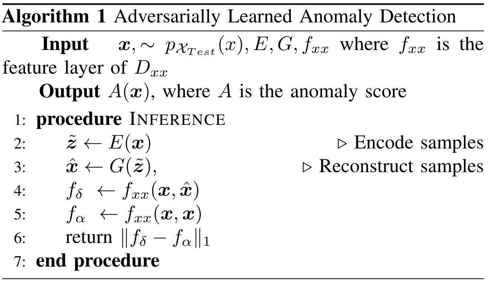
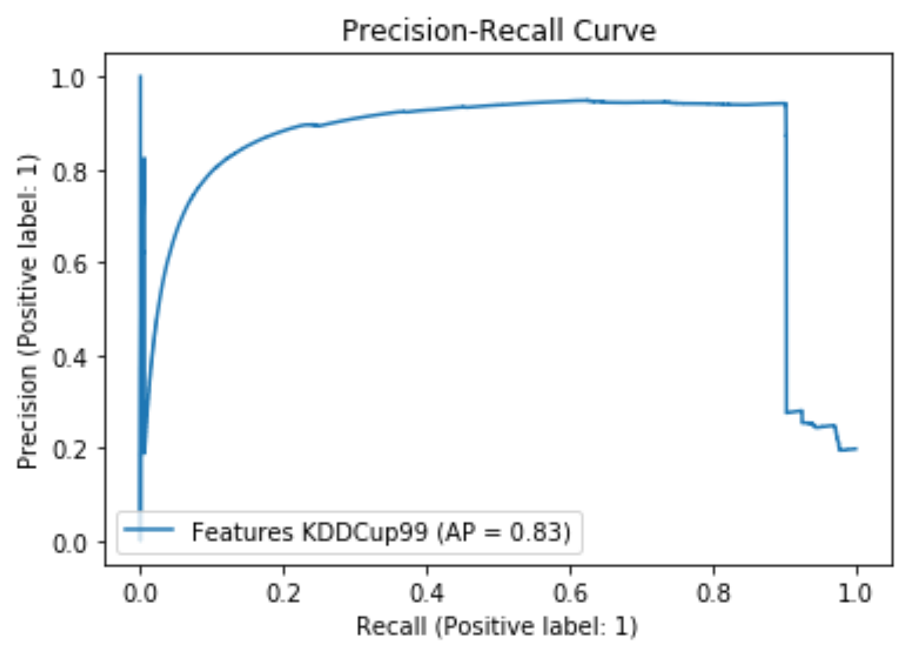
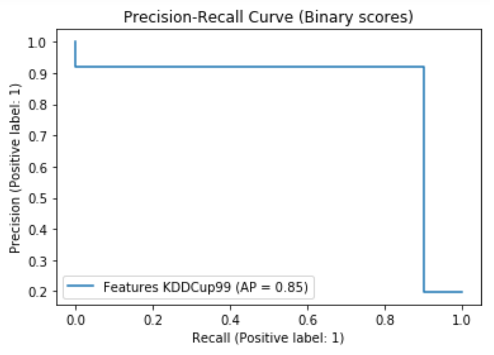
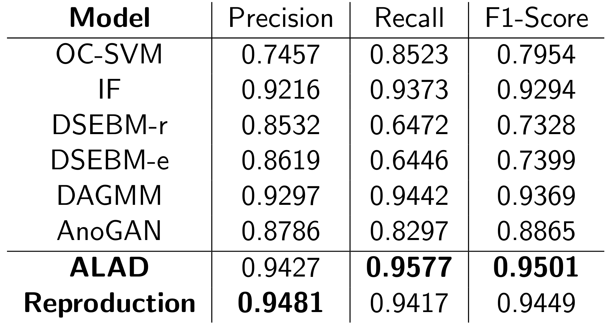
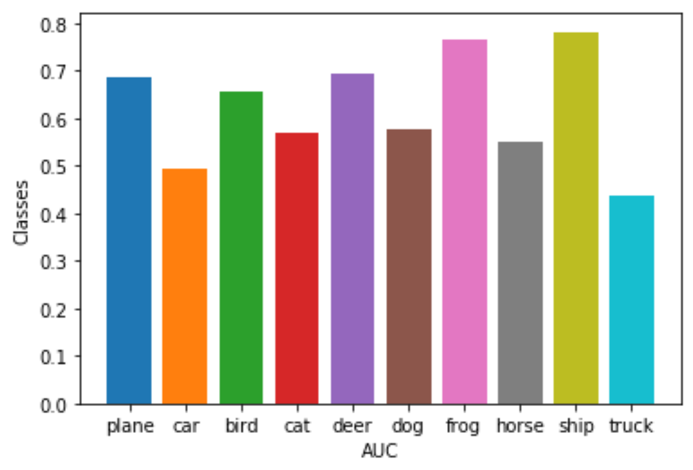
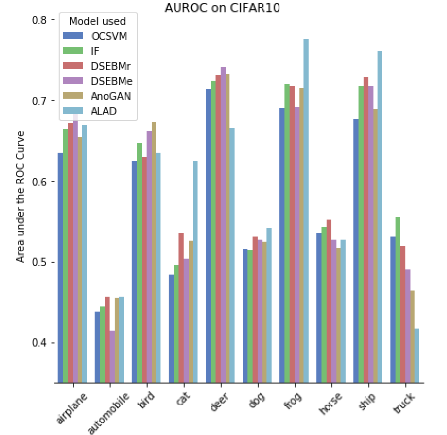

# Adversarially Learned Anomaly Detection[*](https://arxiv.org/pdf/1812.02288.pdf)

This repository reproduces the content of the
Paper [Adversarially Learned Anomaly Detection](https://arxiv.org/pdf/1812.02288.pdf) (ALAD).

## Anomaly Detection
As the name said, anomaly detection is the identification of anomalies in data. 
Instances of data are considered as anomalies, if they differ significantly from the
majority of the data and therefore, raise suspicions. 
Thus, they are also called outliers, noise or novelties.
So, anomaly detection is the identification of rare items, events or observations
[[1](https://avinetworks.com/glossary/anomaly-detection/),
[2](https://en.wikipedia.org/wiki/Anomaly_detection),
[3](https://nix-united.com/blog/machine-learning-for-anomaly-detection-in-depth-overview/)].

In context of Cybersecurity, applications of anomaly detection can vary widely. 
It can be used to detect 
unauthorized access attempts or suspicious activity such as unusual types of 
requests. It is applicable for 
fraud or intrusion detection and can also prevent sensitive data leaks 
[[2](https://en.wikipedia.org/wiki/Anomaly_detection), 
[3](https://nix-united.com/blog/machine-learning-for-anomaly-detection-in-depth-overview/)].

There are three main classes of anomaly detection techniques: unsupervised, semi-supervised, and supervised. 
This repository refers to an unsupervised approach for anomaly detection. One of the most important
assumptions is here that the dataset used for the learning purpose contains mainly non-anomalous data and
only a small partition of the dataset is malicious and abnormal. Thus, unsupervised 
anomaly detection algorithms deem collections of frequent, similar instances to be
normal and identify infrequent data groups as malicious
[[1](https://avinetworks.com/glossary/anomaly-detection/)].

## Introduction to ALAD
The ALAD model belongs to such unsupervised anomaly detection algorithms. 
Its method is predicated on bi-directional GANs [[4](https://arxiv.org/pdf/1605.09782v7.pdf)],
i.e. it consists not only of a generator and discriminator, but also an encoder. The encoder represents the 
opposite operation to the generator. It transforms samples from data space to 
latent space, vice verca the generator. After training the model in an 
unsupervised manner, ALAD outputs scores for each data sample by utilizing reconstructions errors, which indicate whether a data sample is anomalous or not. 
Furthermore, ALAD ensures cycle-consistency between data and latent space and uses methods to 
stabilize GAN-training. By doing so, the ALAD model accomplishes state-of-the-art 
performance on a range of image and tabular datasets. This repository was able to 
reproduce and validate these results.

## ALAD architecture

In GANs, the generator receives random variables, _z_, sampled from a latent Gaussian distribution as input
and tries to generate data, _X_, resembling data space that should be learned. In contrast, the discriminator tries to
distinguish between real data samples and those produced by the generator. During training the generator tries 
to better fool the discriminator and the discriminator tries to better detect real and fake samples.

The architecture of the ALAD model is expanded by a few networks so that it comprises 
a generator _G_, an encoder _E_ and three discriminators _DZZ_,  _DXZ_ and  _DXX_. 
As previously mentioned, Encoder learns to invert the generator which maps data samples _X_ 
to the latent space _z_ during training. Both are not directly connected and they never see their outputs.
Each discriminator obtains as an input a 2D-tuple,  _DXZ_ at first position a 
data sample and  at the second position a latent variable, _DZZ_ at both positions latent variables and _DXX_ 
as well as at both positions samples from data space. 
The discriminator _DXZ_ is similar to the discriminator of 
GAN. It not only distinguish between real and fake sample, but also between _z_ and _E(X)_. So, the generator tries to infer the data space and the encoder to project the data sample into the latent space. 
The discriminator _DXX_ learns to recognize if the second input is equal to the first. The same applies for _DZZ_, only with the different input.

## Stabilizing GAN-Training and objective of ALAD

The aim of this GAN is that cycle-consistency is achieved, i.e. _G_(_E_(_X_)) is almost equal to _X_, in order to use it for athe reconstruction-based anomaly detection method. This is accomplished by incorporating three terms into the objective which is defined as follows:

The first term is known from the BiGAN [[4](https://arxiv.org/pdf/1605.09782v7.pdf)] and second term from the ALICE framework [[5](https://arxiv.org/pdf/1709.01215.pdf)]. The last one was implemented by the authors themself. 

By employing the discriminator _DXX_, it is achieved that the encoder can map data into the latent space so that the generator can best possible reconstruct the encoded samples. The reason is that the generator and encoder "work together" to fool _DXX_.The same principle applies for the discriminator _DZZ_, only vice versa. 

## How to detect anomalies?

It is ensured that the ALAD model can learn to encode and reconstruct samples from data space. The ALAD model is a reconstruction-based anomaly detection technique which evaluates how far 
a sample is from its reconstruction. If the model is exclusively trained with normal samples, then we expect that samples from the normal distribution should be accurately
reconstructed whereas anomalous samples will likely be poorly reconstructed. 
At last, the distance between original and reconstructed samples has to be determined. 
In their own ablation studies it turned out that utilizing the Euclidean distance between the original samples and their reconstructions in data space performed not best. Instead
the output before the logits (i.e. before the last layer) of the discriminator _DXX_ is taken, where once the input is twice the sample itself and once the sample and the corresponding reconstruction. Then, a L1 reconstruction error between the two outputs which is used as an anomaly score.
Therefore, after training the model on normal data, only _G_, _E_ and _DXX_ is needed for the anomaly detection task and can be described as follows:

## Experiment Setup

This repository reproduces the results from the tabular dataset [_KDDCup99_](https://archive.ics.uci.edu/ml/index.php) and the image dataset [_CIFAR-10 dataset_](https://www.cs.toronto.edu/~kriz/learning-features-2009-TR.pdf).
For each dataset, 80% of the whole official dataset is used for training and the
remaining 20% as are kept as test set. 25% from the training set are taken for a validation set. Anomalous samples from both training and validation sets are discarded.

### KDDCup99 dataset

The dataset contains samples of 41 dimensions, where 34 of them are continuous
and 7 are categorical. Categorical features were encoded to one-hot representations resulting in a total of 121 features. Due to the high proportion of outliers in the KDD dataset, "normal" data samples are treated as anomalies. 20% of samples with the highest anomaly scores A(x) are classified as anomalies (positive class).

### CIFAR-10 dataset

Pixels were scaled to be in range -1 and 1. Ten different datasets each CIFAR-10 are computed where each class is once deemed to be normal and the remaining 9 as anomalous.

## Comparison of Paper's and reproduced results 

### KDDCup99 dataset

recision: 0.9481 Recall: 0.9417 F1-Score: 0.9449

### CIFAR-10 dataset

## Conclusion

### Dependencies

- [Python 3.7](https://www.python.org/)
- [PyTorch](https://pytorch.org/)

